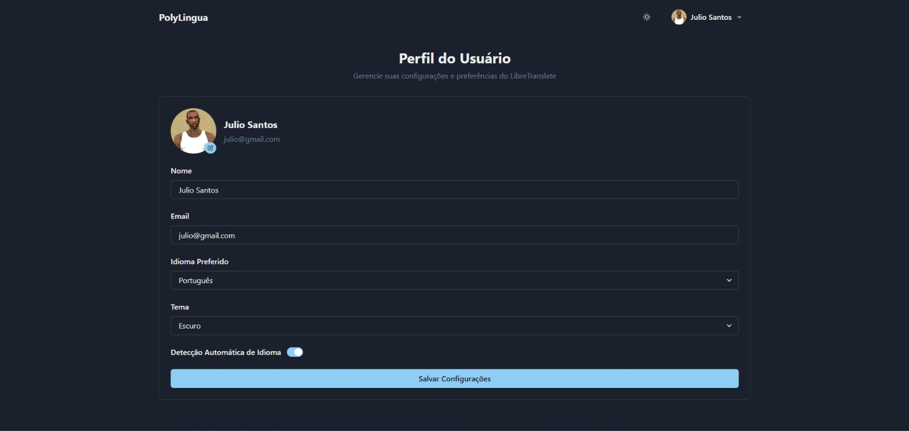
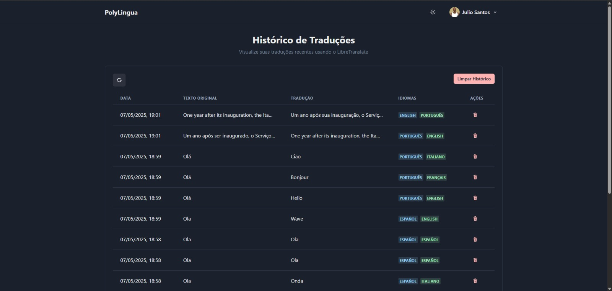
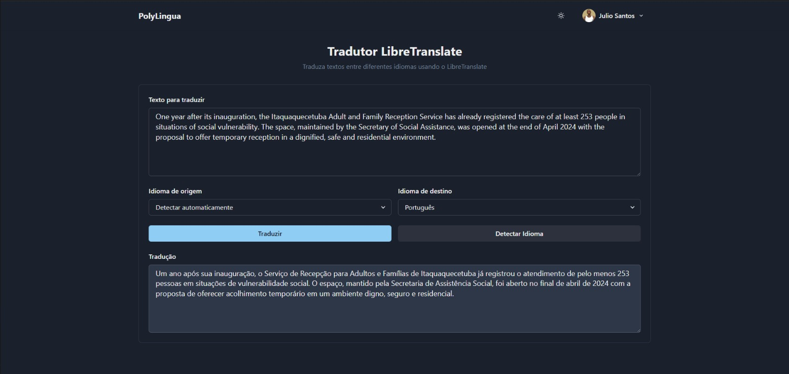

# 🚀 PolyLingua

**Resumo:** O PolyLingua é uma plataforma web de tradução multilíngue que integra tradução automática, reconhecimento de texto em imagens (OCR) e uma interface moderna. O sistema permite traduzir textos e imagens entre diversos idiomas, facilitando a comunicação global de forma acessível e intuitiva.

---

## 🎯 Objetivo

O objetivo do PolyLingua é oferecer uma solução completa para tradução de textos e imagens, integrando tecnologias de processamento de linguagem natural e visão computacional. O sistema resolve a dificuldade de traduzir conteúdos em diferentes formatos e idiomas, sendo útil para estudantes, profissionais e viajantes. O projeto está alinhado com conteúdos de disciplinas como Estrutura de Dados, Linguagens Formais e Autômatos, e Teoria dos Grafos, ao integrar manipulação de dados, APIs e fluxos de informação.

---

## 👨‍💻 Tecnologias Utilizadas


- Python 3.12
- Flask
- Flask-SQLAlchemy
- EasyOCR
- Pillow
- React
- Chakra UI
- Docker Compose
- LibreTranslate
- SQLite
- Axios

---

## 🗂️ Estrutura do Projeto

```
📦 PolyLingua
├── backend
│   ├── app.py
│   ├── models.py
│   ├── auth.py
│   ├── requirements.txt
│   └── ...
├── src
│   ├── App.js
│   ├── components/
│   ├── context/
│   └── ...
├── libretranslate-data
│   └── ...
├── docker-compose.yml
├── requirements.txt
├── package.json
└── docs
    └── README.md
```

---

## ⚙️ Como Executar

### ✅ Rodando Localmente

1. Clone o repositório:

```
git clone https://github.com/seu-usuario/polylingua.git
cd PolyLingua
```

2. Crie o ambiente virtual e ative:

```
python -m venv venv
venv\Scripts\activate  # No Windows
```

3. Instale as dependências do backend:

```
pip install -r backend/requirements.txt
```

4. Instale as dependências do frontend:

```
cd ..
npm install
```

5. Suba o serviço de tradução:

```
docker-compose up -d
```

6. Execute o backend:

```
cd backend
python app.py
```

7. Execute o frontend:

```
npm start
```

---

## 📸 Demonstrações

Abaixo estão algumas telas do sistema PolyLingua em funcionamento:

### Perfil do Usuário

*Gerencie suas configurações e preferências, como nome, email, idioma preferido, tema e detecção automática de idioma.*

### Histórico de Traduções

*Visualize o histórico de traduções realizadas, com data, texto original, tradução, idiomas e ações de gerenciamento.*

### Tradutor LibreTranslate

*Traduza textos entre diferentes idiomas usando o LibreTranslate, com detecção automática de idioma e exibição do resultado.*

## 📹 Vídeo de Demonstração OCR

[](https://youtu.be/CFTzCCOAssI)

---

## 👥 Equipe

| Nome                   | GitHub |
|------------------------|--------|
| Júlio Nascimento Santos| [@juliosntts](https://github.com/juliosntts) |
| Rodrigo Pozo           |        |
| Caique Kelvin          |        |
| Guilherme Toiaiari     | [@Guigts101](https://github.com/Guigts101) |

---

## 🧠 Disciplinas Envolvidas

- Estrutura de Dados I
- Teoria dos Grafos
- Linguagens Formais e Autômatos

---

## 🏫 Informações Acadêmicas

- Universidade: **Universidade Braz Cubas**
- Curso: **Ciência da Computação / Análise e Desenvolvimento de Sistemas**
- Semestre: 2º / 3º / 4º / 5º / 6º
- Período: Manhã / Noite
- Professora orientadora: **Dra. Andréa Ono Sakai**
- Evento: **Mostra de Tecnologia 1º Semestre de 2025**
- Local: Laboratório 12
- Datas: 05 e 06 de junho de 2025

---

## 📄 Licença

MIT License — sinta-se à vontade para utilizar, estudar e adaptar este projeto.
